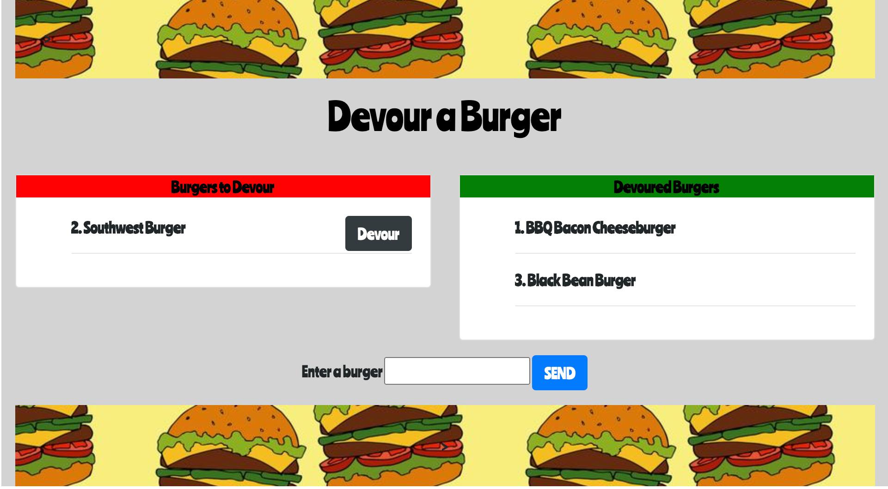
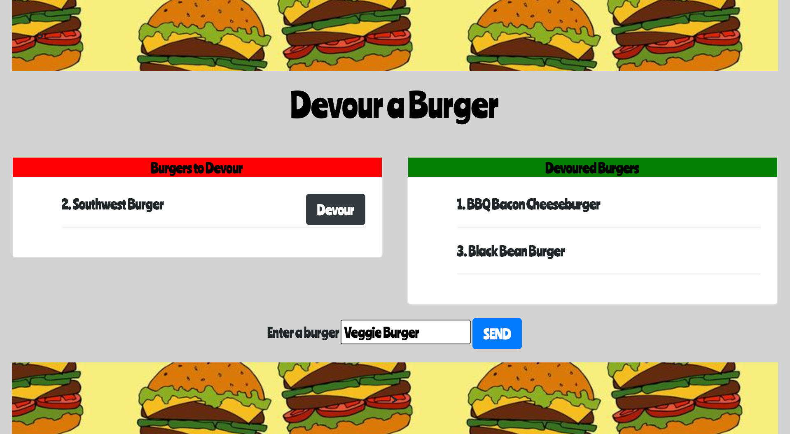
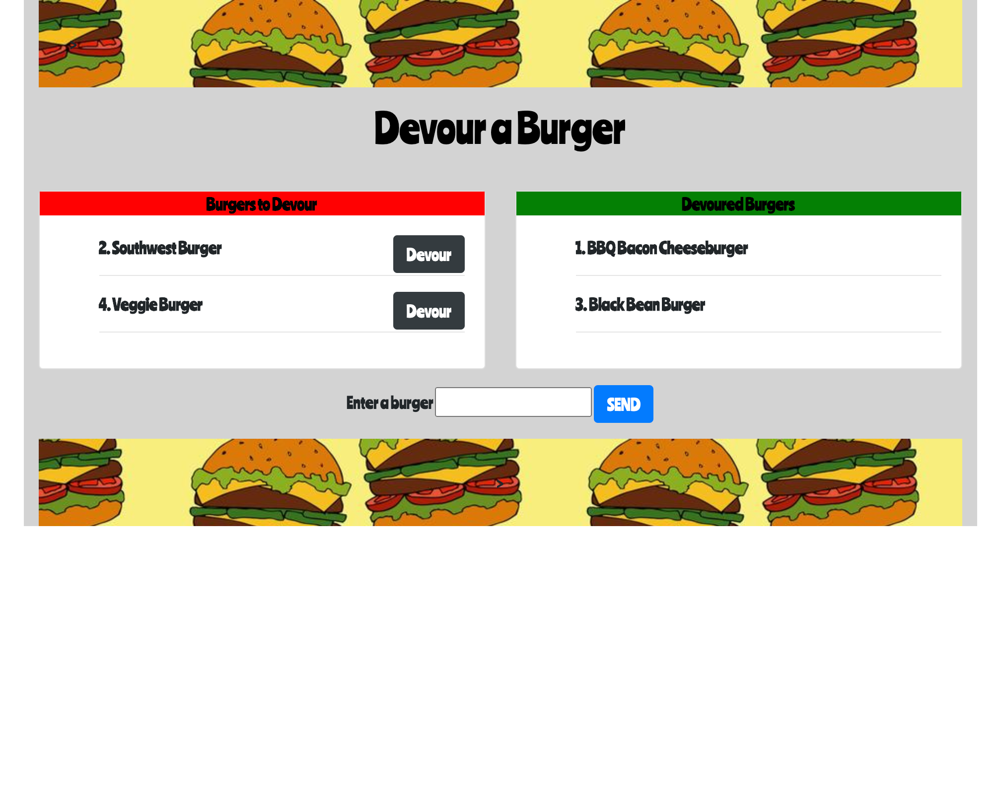
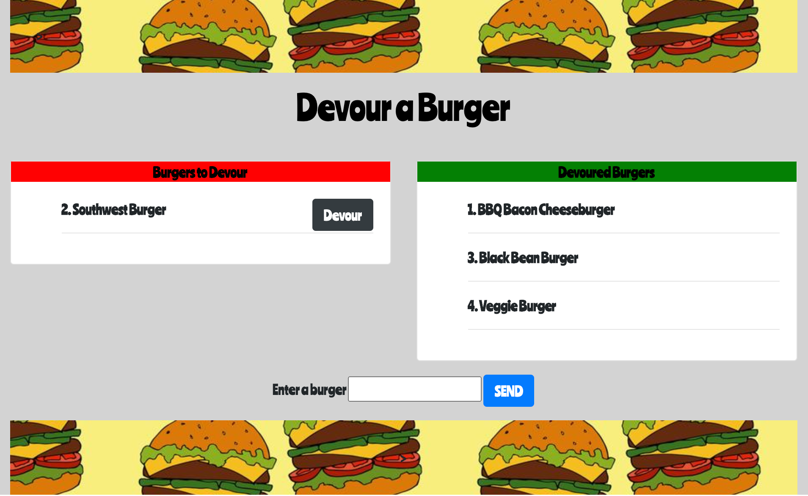

# Devour a Burger

  

## Description 

This application allows you to add a burger of your choice to a list of burgers ready to be devoured.

## Table of Contents

* [Installation](#installation)
* [Usage](#usage)
* [License](#license)
* [Contributing](#contributing)
* [Tests](#tests)
* [Questions](#questions)

## Installation

3 packages must be installed prior to running the app. Enter the following in the command line to install the required packages:

    npm install express express-handlebars mysql

## Usage 

This application is used to keep track of a list of desired burgers and to send a burger to the "Devoured Burgers" list.

## License

This application is covered under the MIT license.

## Contributing

N/A

## Tests

N/A

## Questions

For any additional questions, please send me an e-mail at jackson.meier423@gmail.com

Link to my GitHub: https://github.com/meierj423
